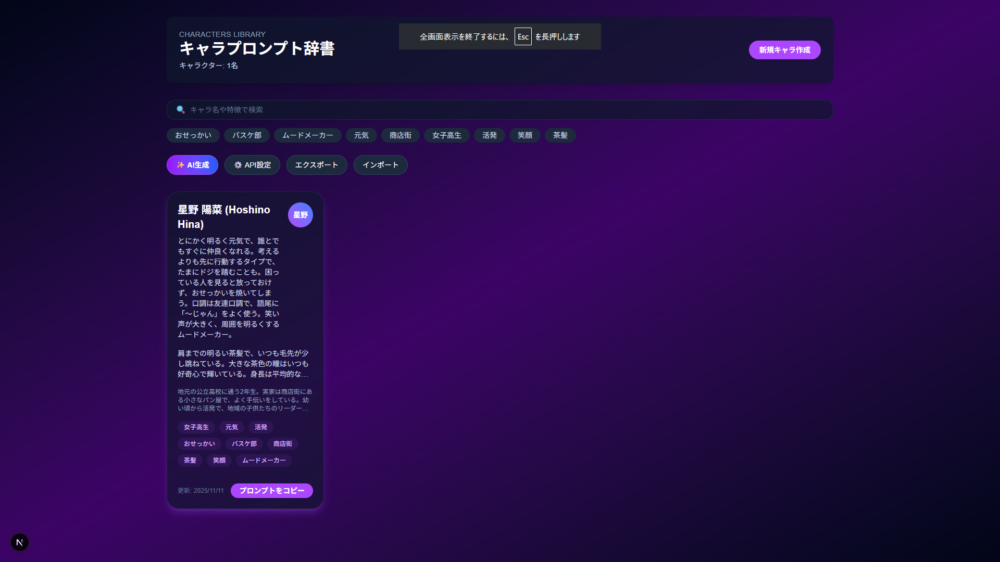

# キャラプロンプト辞書 (Character Prompt Dictionary)

キャラクター設定を一元管理し、AI画像生成やストーリー創作を効率化するWebアプリケーション


## 🎯 概要

**キャラプロンプト辞書**は、小説家、イラストレーター、AI画像生成ユーザー、TRPGプレイヤーなど、創作活動を行う全ての人のためのツールです。

### 主な機能

- ✅ **キャラクター管理**: 外見・性格・背景をカード形式で一元管理
- ✨ **AI自動生成**: Gemini APIでキャラクター設定を自動生成
- 📋 **ワンクリックコピー**: プロンプトを即座にクリップボードへ
- 🔍 **検索・フィルター**: タグや名前で素早くキャラを検索
- 💾 **エクスポート/インポート**: JSON/CSV形式でデータ共有
- 📜 **バージョン管理**: キャラ設定の履歴保存・復元（最大10件）
- 🖼️ **AI画像生成・編集**: Imagen 4 & nano bananaで画像生成・編集

### スクリーンショット



*キャラクター詳細画面 - プロンプト表示とコピー機能*

## 🚀 セットアップ

### 必要要件

- Node.js 18.x 以上
- npm または yarn

### インストール

```bash
# リポジトリをクローン
git clone https://github.com/yourusername/app024-prompt-dict.git
cd app024-prompt-dict/app024

# 依存関係をインストール
npm install

# 開発サーバーを起動
npm run dev
```

開発サーバーが起動したら、ブラウザで `http://localhost:3000` を開いてください。

### ビルド

```bash
# 本番ビルド（静的エクスポート）
npm run build

# ビルドされたファイルは out/ ディレクトリに生成されます
```

## 📖 使い方

### 1. キャラクター作成

1. **新規作成**ボタンをクリック
2. キャラクター情報を入力
   - 名前（必須）
   - 外見
   - 性格・口調
   - 背景・設定
   - タグ（カンマ区切り）
3. **作成**ボタンで保存

### 2. プロンプトコピー

各キャラクターカードの**コピー**ボタンをクリックすると、プロンプトがクリップボードにコピーされます。

### 3. AI機能の利用

#### APIキーの設定

1. **⚙️ API設定**ボタンをクリック
2. Gemini API Keyを入力
   - APIキーは[Google AI Studio](https://aistudio.google.com/app/apikey)で取得
3. **保存**ボタンでLocalStorageに保存

#### AI自動生成

1. **✨ AI生成**ボタンをクリック
2. 簡単な設定を入力（例: "元気な女子高生"）
3. **AI生成**ボタンで自動生成
4. 生成された設定を確認・編集して保存

### 4. データのエクスポート/インポート

#### エクスポート
- **エクスポート**ボタン → **JSON**または**CSV**を選択 → ダウンロード

#### インポート
- **インポート**ボタン → JSONファイルを選択 → インポート

## ⚙️ 技術スタック

- **フレームワーク**: Next.js 16 (App Router)
- **言語**: TypeScript 5.x
- **UI**: React 19, Tailwind CSS 4.x
- **状態管理**: Zustand 5.x
- **テスト**: Jest, React Testing Library, Playwright
- **AI API**: @google/genai (Gemini 2.0, Imagen 4, nano banana)

## 🧪 テスト

```bash
# ユニットテスト実行
npm test

# E2Eテスト実行
npm run test:e2e

# テストカバレッジ
npm run test:coverage
```

## ⚠️ AI機能の課金について

### Gemini API（テキスト生成）

- **モデル**: gemini-2.0-flash-exp
- **無料枠**: 1日1,000回（10 RPM）
- **超過時**: GCP Billing未設定なら利用制限、設定済みなら従量課金
- **用途**: キャラクター自動生成、プロンプト最適化、一貫性チェック

### AI画像生成・編集

#### Imagen 4（高品質・新規生成）

⚠️ **課金対象機能**

- **モデル**: imagen-4.0-generate-001
- **料金**: 1画像あたり$0.04 USD
- **用途**: 新規画像生成のみ
- **UI表示**: 明確な課金警告と同意チェックボックス

#### nano banana（無料枠・生成＋編集）

✅ **無料枠で利用可能**

- **モデル**: gemini-2.5-flash-image-preview
- **無料枠**: 25枚/日（5 RPM制限）
- **用途**: 新規画像生成 ＋ 既存画像の編集
- **編集機能**: 既存サムネイルを元に編集指示で修正可能

### APIキーの管理

- **保存場所**: LocalStorage（ブラウザ内のみ）
- **保存形式**: 平文（暗号化なし）
- **外部送信**: APIキーは外部に送信されません（Gemini API以外）

## 📁 プロジェクト構造

```
app024/
├── app/                    # Next.js App Router
│   ├── components/         # Reactコンポーネント（10個）
│   │   ├── Header.tsx
│   │   ├── CharacterCard.tsx
│   │   ├── CharacterGrid.tsx
│   │   ├── CharacterForm.tsx
│   │   ├── SearchBar.tsx
│   │   ├── TagFilter.tsx
│   │   ├── PromptPreview.tsx
│   │   ├── ExportDialog.tsx
│   │   ├── ImportDialog.tsx
│   │   ├── VersionHistoryDialog.tsx
│   │   ├── AICharacterGenerator.tsx
│   │   ├── ApiKeySettings.tsx
│   │   └── AIImageGenerator.tsx
│   ├── page.tsx            # メインページ
│   └── layout.tsx          # ルートレイアウト
├── lib/                    # ビジネスロジック
│   ├── promptGenerator.ts  # プロンプト生成
│   ├── templateEngine.ts   # テンプレート置換
│   ├── clipboard.ts        # クリップボード統合
│   ├── storage.ts          # LocalStorage永続化
│   ├── exportUtils.ts      # JSON/CSV エクスポート
│   ├── importUtils.ts      # JSON インポート・検証
│   ├── geminiService.ts    # Gemini API統合
│   └── imagenService.ts    # Imagen 4 & nano banana API統合
├── store/                  # 状態管理
│   └── useCharacterStore.ts # Zustand Store
├── types/                  # TypeScript型定義
│   └── index.ts
├── __tests__/              # テスト（18ファイル）
│   ├── components/         # コンポーネントテスト
│   └── lib/                # ユーティリティテスト
└── e2e/                    # E2Eテスト
    └── home.spec.ts
```

## 🔒 データのプライバシー

- **LocalStorage**: 全てのデータはブラウザ内のLocalStorageに保存
- **外部送信**: データは外部サーバーに送信されません
- **APIキー**: LocalStorageに平文で保存（ブラウザのセキュリティに依存）
- **AI機能**: APIキーを使用してGemini APIに設定内容を送信

## 📄 ライセンス

MIT License

## 👥 貢献

バグ報告や機能提案は[Issues](https://github.com/yourusername/app024-prompt-dict/issues)までお願いします。

プルリクエストも歓迎します！

## 📚 ドキュメント

- [要件定義書](doc/requirements.md)
- [技術設計書](doc/design.md)
- [実装計画書](doc/implementation.md)

## 🙏 謝辞

- [Next.js](https://nextjs.org/)
- [React](https://react.dev/)
- [Tailwind CSS](https://tailwindcss.com/)
- [Zustand](https://zustand-demo.pmnd.rs/)
- [Google Generative AI](https://ai.google.dev/)

---

**キャラプロンプト辞書** - あなたの創作活動を効率化します 🎨✨
